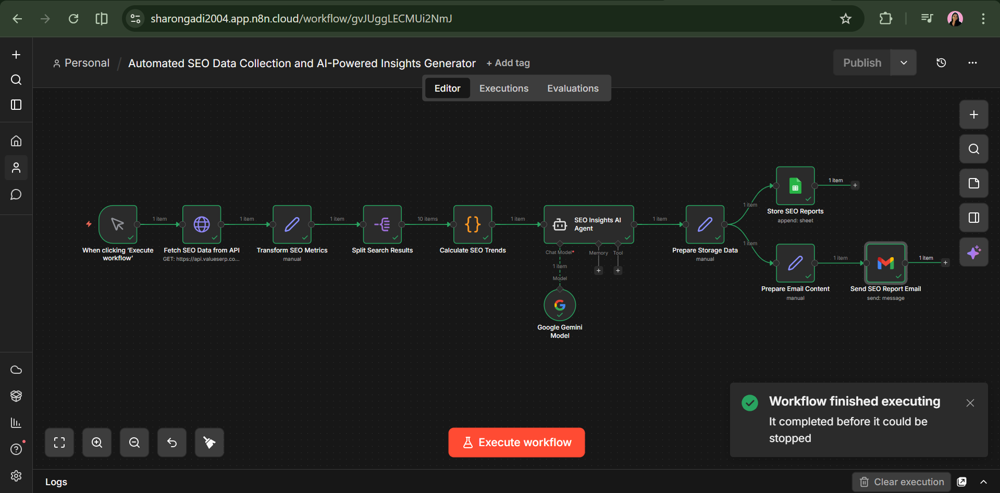
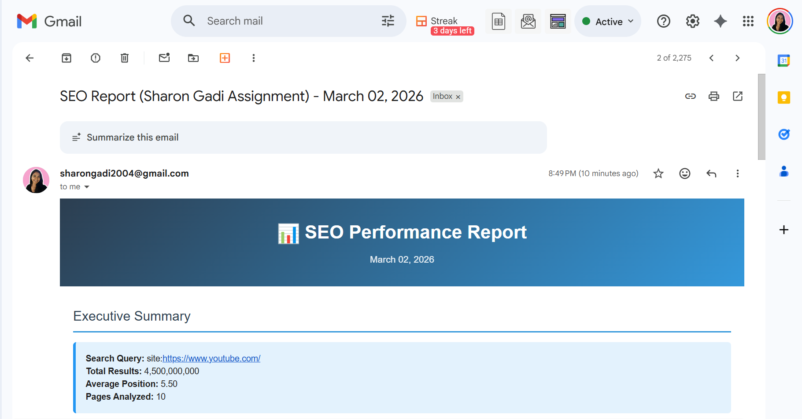
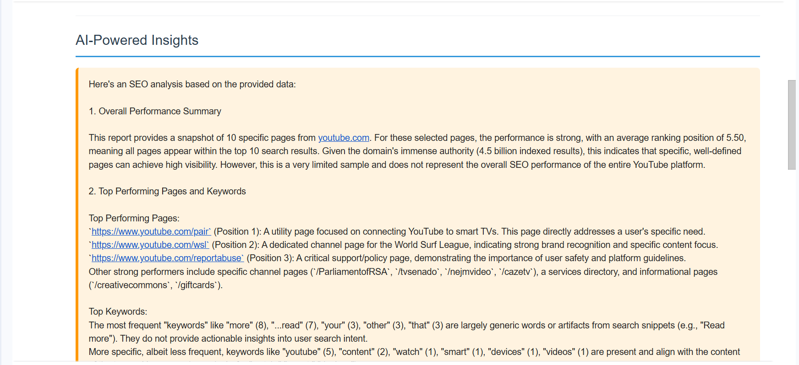
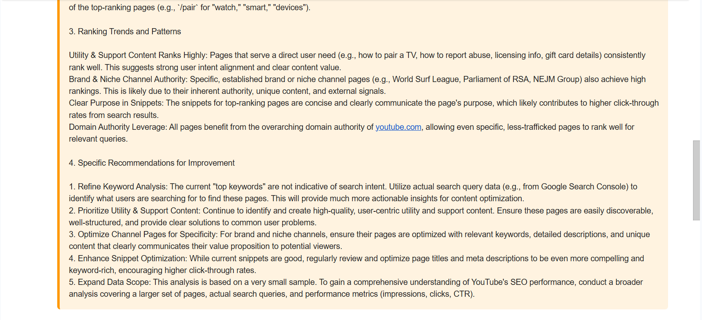
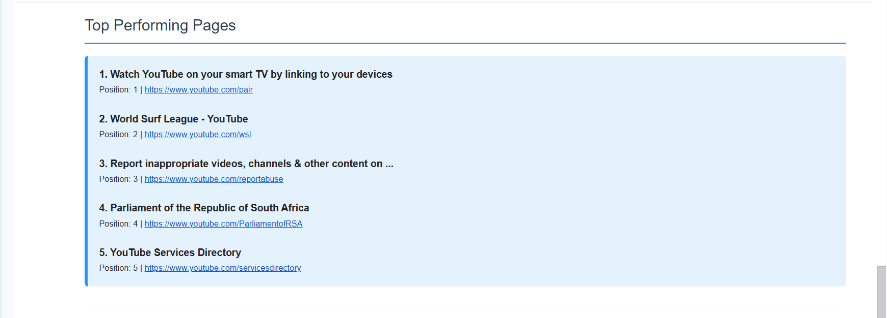
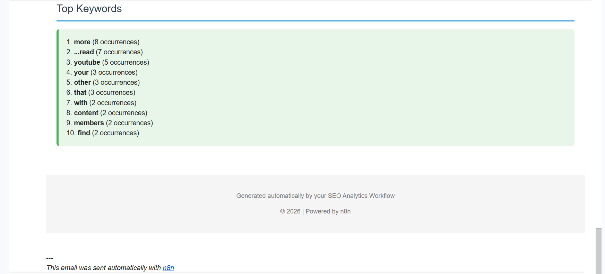

# 🚀 AI-Powered SEO Automation Workflow (YouTube)

## 📸 n8n Automation

---

## 📌 Overview

This project implements an end-to-end AI-powered SEO automation workflow built using **n8n**.

The system automatically:

- Collects real SEO-related data for YouTube
- Processes and analyzes ranking data
- Generates AI-driven insights using **Google Gemini**
- Stores historical results in **Google Sheets**
- Sends a formatted SEO report via **Gmail**

The workflow runs with minimal manual input and demonstrates real-world SEO automation and AI-powered insight generation.

---

## 🎥 Working Automation

**Working Automation Video:**  
https://drive.google.com/file/d/1Fsy0cluTvAuXdcxTdt99aKzah3DpWCsc/view?usp=drive_link  

**n8n Workflow (Node-by-Node Explanation & Code):**  
https://drive.google.com/file/d/1J1vXKbQJK8iKSjDgAol1ow87t0VrQA8o/view?usp=sharing  

**Script:** Please find the attached file.

---

## 📊 Generated Insight Report

(Please find the attached report file.)

---

## 🔎 Data Configuration

**Data Source:**  
Google Search Console API  

**Target Query:** 
site:https://www.youtube.com/

**Automation Platform:**  
n8n  

**AI Model Used:**  
Gemini  

**Execution Date:**  
Auto-generated per run  

---

## 🗂 Historical Data Storage

**Google Sheets (Historical Tracking):**  
https://docs.google.com/spreadsheets/d/1njl06Y6CIn2HsGes9OvQEy0DIYBaGnZqlbOsJSYuPto  

Each workflow execution appends a new row including:

- Search query  
- Total indexed results  
- Average ranking position  
- Top-ranking pages  
- Extracted keywords  
- Execution timestamp  

---

# ⚙️ Workflow Architecture (Node-by-Node)

## 1️⃣ Trigger
- Manual trigger OR scheduled trigger  
- Initiates the workflow execution  

---

## 2️⃣ Fetch SEO Data (API Request)
- Sends automated request to retrieve search-based SEO data  
- Pulls real-time ranking and indexing metrics  

**Metrics Collected:**
- Search query  
- Total indexed results  
- Average ranking position  
- Top ranking pages  
- Extracted keywords from snippets  
- Timestamp  

---

## 3️⃣ Data Transformation & Processing
- Parses API response into structured JSON  
- Extracts:
  - Page URLs  
  - Ranking positions  
  - Snippet text  

- Performs calculations:
  - Average ranking position  
  - Top-performing pages  
  - Keyword frequency analysis  
  - Trend identification  

Processing is handled via JavaScript / Python logic inside n8n.

---

## 4️⃣ AI Insights Generation (Gemini)

Aggregated metrics are sent to the Gemini AI model.

The AI generates:

- Executive summary  
- SEO performance interpretation  
- 2–3 actionable SEO recommendations  
- Observations on ranking patterns  
- Keyword usage insights  

---

## 5️⃣ Data Storage (Google Sheets)

- Appends processed data to Google Sheets  
- Enables historical SEO trend tracking  
- Supports long-term performance monitoring  

---

## 6️⃣ Email Report Delivery (Gmail)

A formatted SEO report is automatically generated and sent to:

**sharongadi2004@gmail.com**

The email includes:

- Executive summary  
- AI-powered insights  
- Top-performing YouTube pages  
- Keyword analysis  
- SEO recommendations  
- Execution timestamp  

The report requires no manual formatting.

---

## 📈 Output Example

Each email report contains:

- Query summary  
- Total results  
- Average ranking position  
- AI-driven SEO performance analysis  
- Top-ranking YouTube pages  
- Extracted keyword insights  
- Specific recommendations  
- Timestamp  

---

## 🛠 Tools & Technologies Used

- Automation Platform: n8n  
- SEO Data Collection: Google Search Console API  
- Data Processing: JavaScript / Python inside n8n  
- AI Model: Google Gemini  
- Storage: Google Sheets  
- Email Delivery: Gmail  
- Visualization (optional): n8n dashboards  

---

## ▶️ How to Run the Workflow

1. Import the workflow into n8n  
2. Configure credentials:
   - Google API (Search Console / Sheets)  
   - Gmail  
   - Gemini API key  
3. Verify Google Sheet access permissions  
4. Set execution mode:
   - Manual (for testing)  
   - Scheduled (daily / weekly)  
5. Execute workflow  
6. Confirm:
   - Data appended to Google Sheets  
   - SEO report received via email  

---

## ⭐ Key Features

- Uses real, live SEO data  
- Fully automated end-to-end execution  
- AI-generated insights and recommendations  
- Historical tracking via Google Sheets  
- Minimal manual input required  

---

## 📬 Mail Sent to Inbox

---

## 👤 Owner

**Sharon Gadi**  
Email: sharongadi2004@gmail.com
